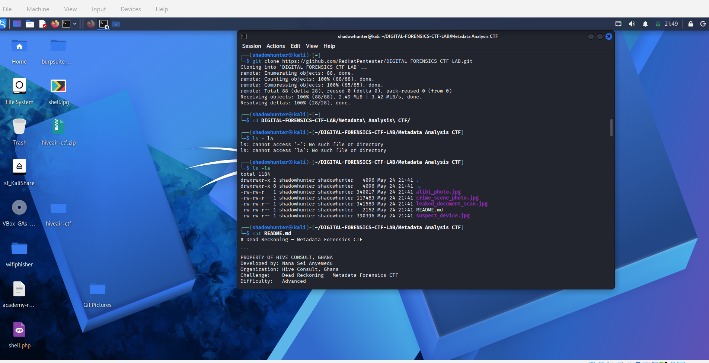
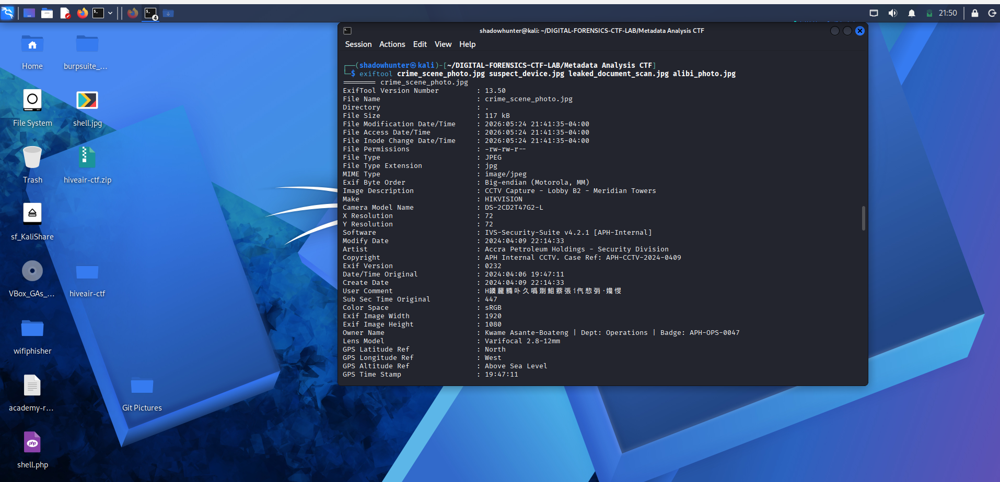
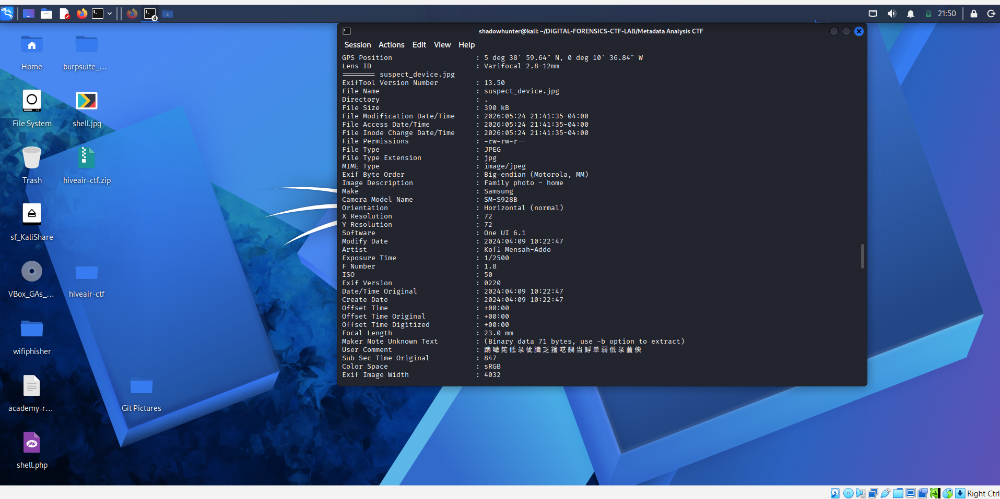
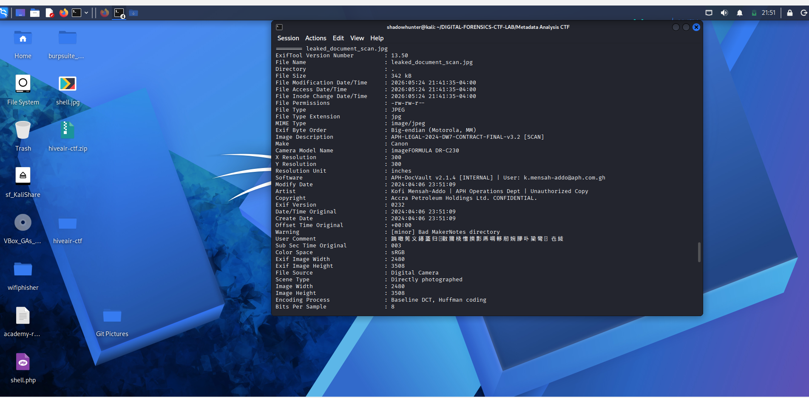
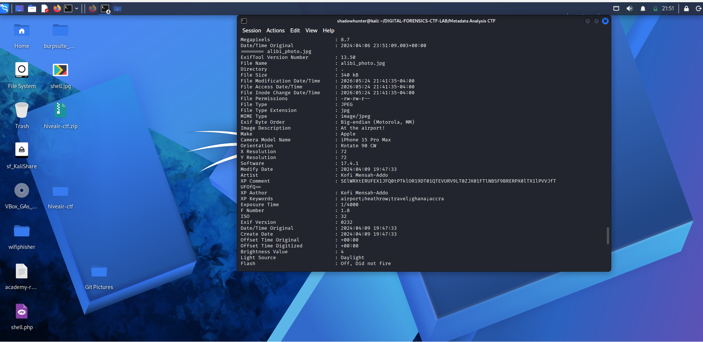
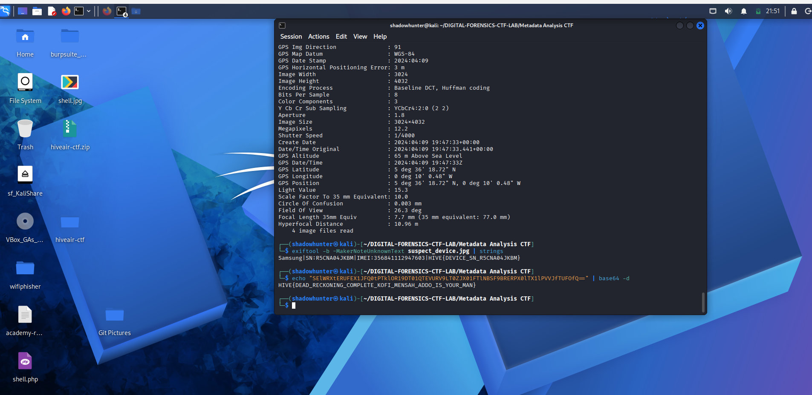

# 🕵️ Dead Reckoning — Metadata Forensics CTF Write-Up

> **Challenge:** Dead Reckoning — Metadata Forensics CTF  
> **Category:** Digital Forensics / Metadata Analysis  
> **Difficulty:** Advanced  
> **Author:** Nana Sei Anyemedu — Hive Consult, Ghana  
> **Analyst:** Abubakar Sadik  

---

## 📖 Case Background

A senior operations analyst at **Accra Petroleum Holdings (APH)** was found dead in his apartment on the night of **April 9, 2024**. His company laptop was missing. Three days prior, highly classified petroleum exploration contracts were leaked to an unknown foreign entity.

Police recovered a USB drive at the scene containing **four image files**. A prime suspect — **Kofi Mensah-Addo**, APH Operations Department — claimed he was in London at the time, about to board a flight back to Accra.

**Mission:** Prove or disprove his alibi using metadata.

---

## 🗂️ Evidence Files

| File | Description |
|------|-------------|
| `crime_scene_photo.jpg` | CCTV capture from the scene |
| `suspect_device.jpg` | Photo from suspect's personal phone |
| `leaked_document_scan.jpg` | Scan of the leaked contract |
| `alibi_photo.jpg` | Suspect's claimed airport selfie |

---

## 🛠️ Tools Used

| Tool | Purpose |
|------|---------|
| `exiftool` | Extract metadata from all image files |
| `exiftool -b \| strings` | Extract binary MakerNote hidden data |
| `base64 -d` | Decode base64-encoded hidden flag |

---

## 🔍 Step 1 — Clone the Lab & Inspect Files

```bash
git clone https://github.com/RedHatPentester/DIGITAL-FORENSICS-CTF-LAB.git
cd DIGITAL-FORENSICS-CTF-LAB/Metadata\ Analysis\ CTF/
ls -la
cat README.md
```



This revealed four JPEG evidence files and a README detailing the 8 questions to solve.

---

## 🔍 Step 2 — Dump Metadata from All Files

```bash
exiftool crime_scene_photo.jpg suspect_device.jpg leaked_document_scan.jpg alibi_photo.jpg
```



---

## ✅ Q1 — True Location in Crime Scene Photo

From `crime_scene_photo.jpg` metadata:

```
GPS Latitude  : [REDACTED]
GPS Longitude : [REDACTED]
GPS Position  : [REDACTED]
```

📍 **Finding:** The GPS coordinates place the CCTV camera at **[REDACTED]** — contradicting the official report's stated location.

---

## ✅ Q2 — Two Timestamps & The Discrepancy

```
Date/Time Original : [REDACTED]   ← when photo was taken
Modify Date        : [REDACTED]   ← when file was modified
```

⚠️ **Finding:** The footage was originally captured on **April 6** but was modified/re-processed on **April 9 at 22:14** — the same night as the murder. This is clear evidence of **footage tampering**.

---

## ✅ Q3 — Timezone in Suspect's Phone Photo



```
Offset Time Original : [REDACTED]
```

🌍 **Finding:** London in April operates on **BST ([REDACTED])**. The suspect's Samsung Galaxy S24 Ultra recorded timezone **[REDACTED] ([REDACTED])**. This proves his phone was **not in the UK** when the photo was taken.

---

## ✅ Q4 — Device Serial Number (Hidden in Binary MakerNote)

```bash
exiftool -b -MakerNoteUnknownText suspect_device.jpg | strings
```

```
Samsung|SN:[REDACTED]|IMEI:[REDACTED]|[REDACTED]
```

📱 **Finding:**
- **Device:** Samsung SM-S928B (Galaxy S24 Ultra)
- **Serial Number:** `[REDACTED]`
- **IMEI:** `[REDACTED]`
- 🚩 **Flag:** `[REDACTED]`

---

## ✅ Q5 & Q6 — Leaked Document Author & Email



```
Artist   : Kofi Mensah-Addo | APH Operations Dept | Unauthorized Copy
Software : [REDACTED] [INTERNAL] | User: [REDACTED]
Scanner  : Canon imageFORMULA DR-C230
```

📄 **Findings:**
- **Real Author:** Kofi Mensah-Addo
- **Internal Software:** [REDACTED]
- **Email embedded:** `[REDACTED]`

The Artist field self-incriminates with the tag **"Unauthorized Copy"**. The suspect used his own corporate account to scan and leak classified documents.

---

## ✅ Q7 — Alibi Photo GPS vs Heathrow



```
GPS Latitude  : [REDACTED]
GPS Longitude : [REDACTED]
GPS Position  : [REDACTED], [REDACTED]
```

| Location | Coordinates |
|----------|-------------|
| **Embedded in photo** | [REDACTED] → **[REDACTED]** |
| **Heathrow (claimed)** | [REDACTED] → London, England |
| **Distance apart** | ~[REDACTED] |

✈️ **Finding:** The suspect claimed to be at Heathrow Airport. The GPS in his iPhone 15 Pro Max places him at **[REDACTED]**. [REDACTED]

---

## ✅ Q8 — Base64 Flag in XPComment Field



```
XP Comment : [REDACTED]
```

```bash
echo "[REDACTED]" | base64 -d
```

```
[REDACTED]
```

🚩 **Flag:** `[REDACTED]`

---

## 🏁 Flags Captured

| # | Flag |
|---|------|
| 🚩 Flag 1 | `[REDACTED]` |
| 🚩 Flag 2 | `[REDACTED]` |

---

## 📋 Full Answers Summary

| Question | Answer |
|----------|--------|
| **Q1** — True GPS location | `[REDACTED]` → [REDACTED] |
| **Q2** — Timestamp discrepancy | [REDACTED] |
| **Q3** — Timezone offset | `[REDACTED]` [REDACTED] not `[REDACTED]` [REDACTED] |
| **Q4** — Device serial | `[REDACTED]` / IMEI: `[REDACTED]` |
| **Q5** — Document author & software | Kofi Mensah-Addo / [REDACTED] |
| **Q6** — Embedded email | `[REDACTED]` |
| **Q7** — Alibi photo GPS | [REDACTED] |
| **Q8** — Decoded flag | `[REDACTED]` |

---

## 🧠 Key Lessons

- **ExifTool** is the single most powerful tool for metadata forensics CTFs
- GPS coordinates embedded in images **never lie** — always cross-check claimed locations
- **Timezone offsets** in EXIF data can disprove location-based alibis
- Binary MakerNote fields can hide **device identifiers and flags** — always extract with `-b | strings`
- **Timestamps** can reveal tampering — compare `Date/Time Original` vs `Modify Date`
- Base64 strings hidden in obscure fields like `XPComment` are classic CTF flag placement

---

## 📚 References

- [ExifTool Documentation](https://exiftool.org/)
- [CTF Lab Repository](https://github.com/RedHatPentester/DIGITAL-FORENSICS-CTF-LAB)
- [CyberChef — Online Decoder](https://gchq.github.io/CyberChef)

---

*Write-up by **Abubakar Sadik** — Digital Forensics CTF*
